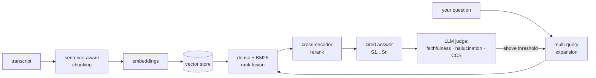

# Unicorn Journeys RAG

[](https://github.com/maliyuam/unicorn-journeys-rag/actions/workflows/ci.yml)
[](LICENSE)
[](https://www.python.org/downloads/)

Turn interview transcripts into **narratives you can check**: every sentence
carries an inline `[S1]` citation back to the passage it came from, and every
narrative is scored for faithfulness and hallucination before you see it.

It is a working rebuild — with a web UI, a hybrid retriever, and a real
evaluation harness — of the RAG pipeline from *"Generative AI Methodology for
Uncovering Entrepreneurial Journeys in Africa"*
([SSRN 5184838](https://papers.ssrn.com/sol3/papers.cfm?abstract_id=5184838)),
which analysed media about sixteen African unicorn founders.

**It runs with no API key, no database, and no network.** Retrieval, citation
and evaluation all work offline; credentials upgrade the quality, they are not
a prerequisite.

---

## Quickstart

```bash
git clone https://github.com/maliyuam/unicorn-journeys-rag.git
cd unicorn-journeys-rag
pip install -r requirements.txt
python -m uvicorn backend.app:app --port 8017
```

Open <http://localhost:8017>, click **Load sample corpus**, and ask the
**Ask** tab something like *"When did PaySwift get its licence?"*

That is the whole setup. The bundled sample corpus gives you a working system
in one click; the status bar tells you which store, embedder and LLM mode are
actually in use.

<details>
<summary>Prefer Docker?</summary>

```bash
docker compose up
```

Then open <http://localhost:8017>. Add credentials in `.env` when you want
them — see [docs/deployment.md](docs/deployment.md).
</details>

### What you just ran



The loop at the end is the point: when the judge finds unsupported claims, the
narrative is **regenerated** with those claims flagged, re-judged, and the
better draft is kept.

## The sample corpus is fictional, on purpose

`data/samples/` contains four invented interviews with invented founders at
invented companies. Nothing in them is a record of anything a real person said.

That is deliberate. A demo that ships real interview transcripts would put real
people's words into machine-generated narratives, paraphrased and truncated,
for the sake of a first-run experience. The fictional corpus exercises every
stage of the pipeline — and the golden set in
`data/eval/goldens.samples.json` is labelled against it, so you can run the
full evaluation harness on a fresh clone.

Real media is **not** shipped: it belongs to whoever published it. The
connectors collect it onto your own machine, into a git-ignored directory. See
[docs/data-collection.md](docs/data-collection.md).

## Using it on real people

```bash
# is transcript fetching reachable from this network right now?
curl localhost:8017/api/connectivity

# discover → filter → fetch → ingest across the founder roster
curl -X POST localhost:8017/api/sweep -H "Content-Type: application/json" \
  -d '{"max_candidates": 6, "search_results": 10}'
```

Discovery is **human-in-the-loop**: it searches YouTube and podcast RSS, filters
candidates for relevance with a reason attached to each verdict, and ingests
nothing until a human approves. You can also just upload `.txt`, `.md`,
`.json`, `.srt` or `.vtt` files in the Ingest tab.

Two things will bite you, and both are documented in full:

- **YouTube rate-limits transcript fetching**, and volume triggers it. The
  sweep is idempotent, so you can re-run it after a block clears and it picks
  up exactly what is missing. Podcasts are the channel that keeps working.
- **Misattribution is the expensive failure.** Filing one person's interview
  under another founder's name puts a stranger's career into a narrative, with
  citations that look perfectly legitimate. Two real cases of this, and the two
  audits that now catch them, are written up in
  [docs/data-collection.md](docs/data-collection.md#attribution-the-failure-that-actually-costs-you).

## Configuration

Copy `.env.example` to `.env`. Every setting has a working default; the ones
that matter most:

| Variable | Default | What it does |
|---|---|---|
| `ANTHROPIC_API_KEY` | unset | Enables Claude generation, judging and query expansion. Unset ⇒ offline extractive mode. |
| `MONGODB_URI` | unset | Unset ⇒ local file index. Set ⇒ MongoDB, with native `$vectorSearch` on Atlas. |
| `EMBEDDING_BACKEND` | `auto` | `voyage` → `fastembed` → `sentence-transformers` → `tf-idf`, first available. |
| `VECTOR_STORE` | `auto` | `auto` follows `MONGODB_URI`; force with `local` or `mongodb`. |
| `INDEX_DIR` | `data/index` | Where the local index lives — point it elsewhere for a volume or a scratch instance. |
| `RERANK_ENABLED` | `1` | Cross-encoder reranking. `0` still retrieves, just less precisely. |
| `DEFAULT_TOP_K` | `7` | Passages per query. The paper's measured optimum. |
| `EVAL_GOLDENS_FILE` | `goldens.json` | Which golden set to score against. |

Several defaults are **measured, not guessed** — `FUSION_POOL_MULTIPLIER` and
`CHUNK_TARGET_WORDS` in particular. Raising the fusion pool dropped hit@7 from
0.882 to 0.824. Re-run the harness before changing them; `.env.example` says so
inline.

## Evaluation

```bash
# works on a fresh clone, against the sample corpus, no LLM calls
EVAL_GOLDENS_FILE=goldens.samples.json python scripts/evaluate.py --retrieval
```

Error analysis first, metrics second. The harness reports a **precision
ceiling** beside raw precision (a fact living in one chunk can never beat 1/k),
flags goldens whose evidence is missing from the corpus as **broken labels**
rather than model failures, and prints the questions that missed along with
what was retrieved instead.

It has earned its keep by rejecting two plausible changes and catching a query
expansion bug that was silently dropping the user's question. Full write-up,
including the three-way error analysis behind the reranker:
[docs/evaluation.md](docs/evaluation.md).

## API

| Endpoint | Purpose |
|---|---|
| `GET /api/status` | Backends in use + corpus stats |
| `GET /api/founders` | Indexed founders with chunk counts |
| `POST /api/ingest/samples` | Ingest the bundled fictional sample corpus |
| `POST /api/ingest` | Ingest one transcript `{founder, company, source_title, source_type, text}` |
| `POST /api/ingest/upload` | Multipart upload of `.txt/.md/.json/.srt/.vtt` → background job |
| `POST /api/ingest/batch` | `{docs: [...]}` bulk ingest → background job |
| `POST /api/discover` | Search YouTube/RSS + relevance filter → job returning candidates |
| `POST /api/discover/ingest` | Fetch transcripts for approved candidates → background job |
| `POST /api/sweep` | Discover + ingest across the roster → job with per-founder results |
| `GET /api/roster` | The founder roster from `data/founders.json` |
| `GET /api/connectivity` | Can transcripts be fetched from this network right now? |
| `GET /api/podcasts/search?term=` | Find podcast RSS feeds by name |
| `GET /api/podcasts/curated` | The verified African tech podcast feed list |
| `POST /api/audit/attribution` | LLM judges whether the founder really appears in each source |
| `GET /api/jobs/{id}` | Job status + progress |
| `GET /api/sources` | Ingested source registry |
| `DELETE /api/sources/{id}` | Remove a source and its chunks |
| `POST /api/ask` | `{question, founder?, k?}` → expansion, fused chunks, cited answer |
| `POST /api/narrative` | `{founder, k?}` → narrative + faithfulness, hallucination, CCS, refinement |
| `POST /api/eval` | Run the evaluation harness → background job |
| `GET /api/eval/latest` | The last saved evaluation baseline |
| `POST /api/clear` | Drop the index |

> **No authentication.** `POST /api/clear` drops your index and is open to
> anyone who can reach the port. Fine on localhost, wrong on the public
> internet — see [SECURITY.md](SECURITY.md).

## What changed from the paper

| Stage | Paper (v1) | This rebuild (v2) |
|---|---|---|
| Chunking | Fixed 150-word cuts | **Sentence-aware** ~220-word chunks — no mid-sentence splits |
| Embeddings | all-MiniLM-L6-v2 | Pluggable: **Voyage** or **BAAI/bge-small-en-v1.5**, TF-IDF offline fallback |
| Vector store | MongoDB | **Atlas `$vectorSearch`**, auto-provisioned, with cosine and local fallbacks |
| Retrieval | Pure cosine | **Hybrid dense + BM25 rank fusion**, then **cross-encoder reranking** |
| Query expansion | Free-text, parsed by hand | **Schema-constrained structured output**, deterministic offline fallback |
| Generation | GPT-4o mini | **Claude Opus 5**, or offline extractive |
| Grounding | Uncited | **Inline `[S1]…[Sn]` citations**, traceable in the UI |
| Evaluation | Free-text JSON judge | Claim-level judge with **strict schemas** + offline lexical fallback |
| Refinement | Manual re-prompt | **Automatic**: regenerate flagged claims, re-judge, keep the better draft |
| Interface | Scripts only | **Web UI** + JSON API + 70 tests |

## Documentation

| | |
|---|---|
| [docs/architecture.md](docs/architecture.md) | How each stage works and why it is built that way |
| [docs/evaluation.md](docs/evaluation.md) | The harness, the metrics, and the error analysis |
| [docs/data-collection.md](docs/data-collection.md) | Connectors, rate limits, cookies, attribution audits |
| [docs/deployment.md](docs/deployment.md) | Local, Docker, Compose, MongoDB Atlas |
| [CONTRIBUTING.md](CONTRIBUTING.md) | Setup, the bar for changes, good first issues |
| [SECURITY.md](SECURITY.md) | Credential handling and vulnerability reporting |

## Development

```bash
pip install -r requirements.txt && pip install pytest ruff
ruff check .
python -m pytest tests/ -q     # 70 tests
```

The suite needs no credentials and never touches a configured MongoDB — a
`conftest.py` fixture forces the offline LLM and an empty `MONGODB_URI`, so
running it cannot bill an API key or wipe a live collection. It is not fully
network-free on a cold machine: several tests build a real `Engine`, which
downloads the ~130 MB embedding model once (CI caches it).

## Licence

[MIT](LICENSE) for the code and the fictional sample corpus.

It does not cover the paper, which remains the work of its authors, or any
media you collect with the connectors, which belongs to whoever published it.
